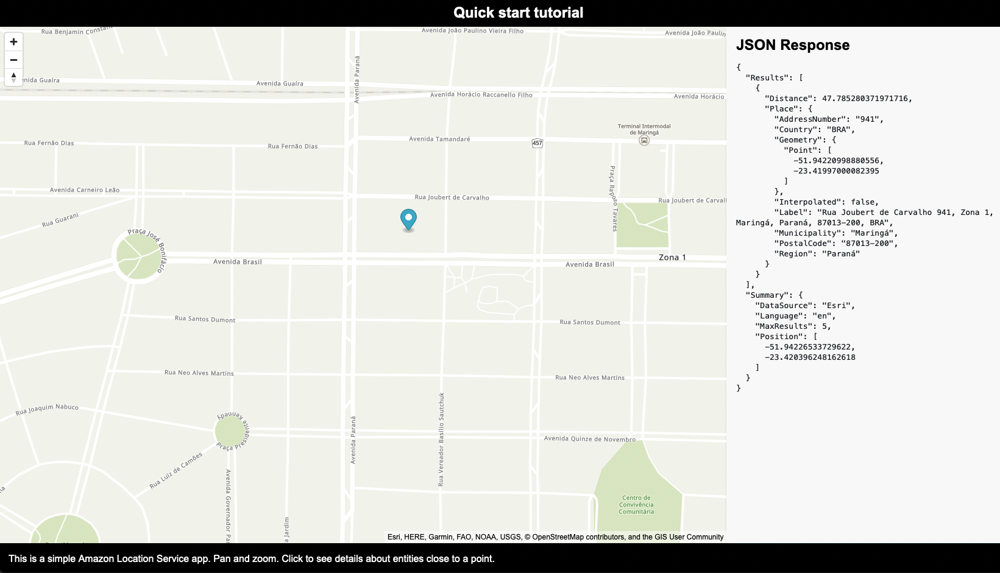

# SEARCH PLACES
This project is based on the [AWS Quick Start](https://docs.aws.amazon.com/location/latest/developerguide/qs-web.html) guide for a web application that shows data about a chosen map place. 

I also added a [AWS CloudFormation](https://aws.amazon.com/cloudformation/) template ([aws-infra.yaml](./aws-infra.yaml)) that enables easily provisioning the AWS infrastructure.

## Overview
The Figure below shows the result of running the application. You can see the map at the center of the Figure. The map is provided by the _Map resource_ feature. At the left-hand side, you see the JSON response of searching for a place on the map. The _Places search resource_ provides the JSON response.

The [`main.js`](./main.js) file carries the code responsible for loading the map and running the place search feature. The code should be straightforward to understand - just have a look at it.

The [`aws-infra.yaml`](./aws-infra.yaml) file is a AWS CloudFormation template that describes the infrastructure resources used in this project. The AWS infrastructure consists of:
- A [map resource](https://docs.aws.amazon.com/location/latest/developerguide/map-concepts.html) that enables rendering and searching locations;
- A [places search](https://docs.aws.amazon.com/location/latest/developerguide/places-concepts.html) resource that enables retrieving data about a map location;
- An identity pool that provides permissions for accessing map and places search; and,
- An IAM role, policy, and attachment to the identity pool that set permissions for using the resources.

## Run the Project

1. Open the [AWS CloudFormation console](https://console.aws.amazon.com/cloudformation/) and use the [`aws-infra.yaml`](./aws-infra.yaml) file for creating a stack.

2. Open the [Amazon Cognito Identity Pool console](https://console.aws.amazon.com/cognito/pool) identify the identity pool ID, and paste it to the [`main.js`](./main.js), at line 6: `const identityPoolId = "IDENTITY-POOL-ID-HERE"`

3. Open the [`quickstart.html`](./quickstart.html) file on your browser to see the application working.

> Please, do not forget to delete your stack once you finished investigating the project.